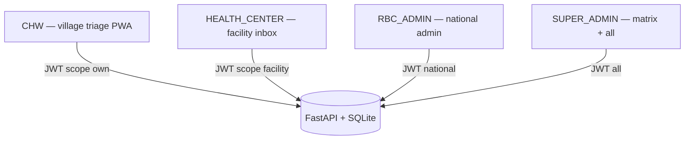
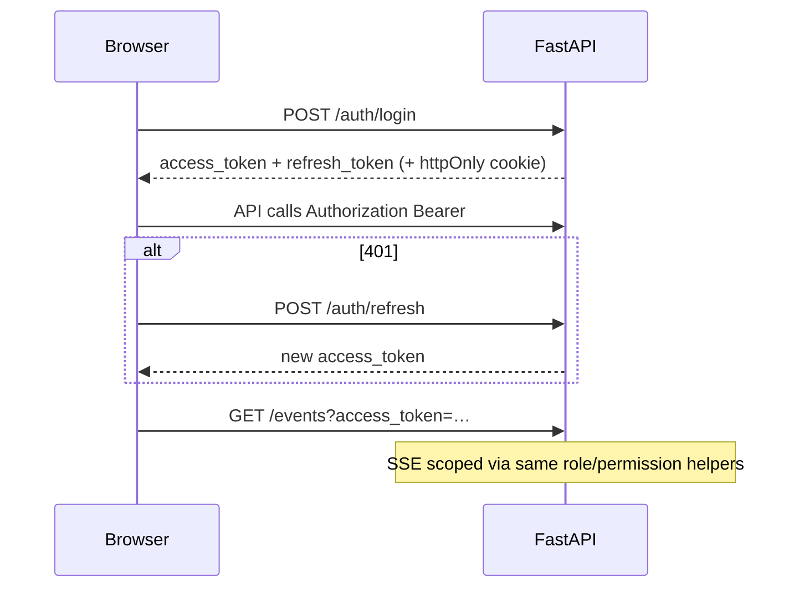
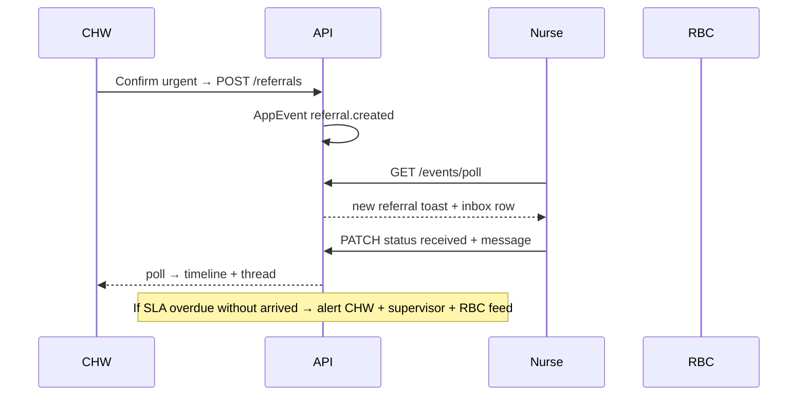
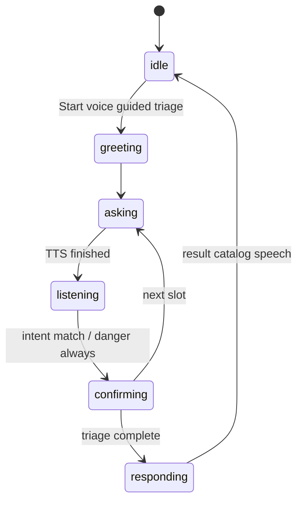
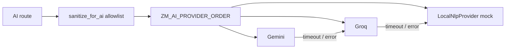
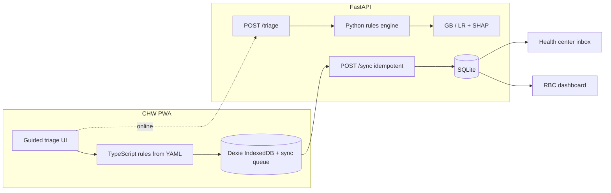
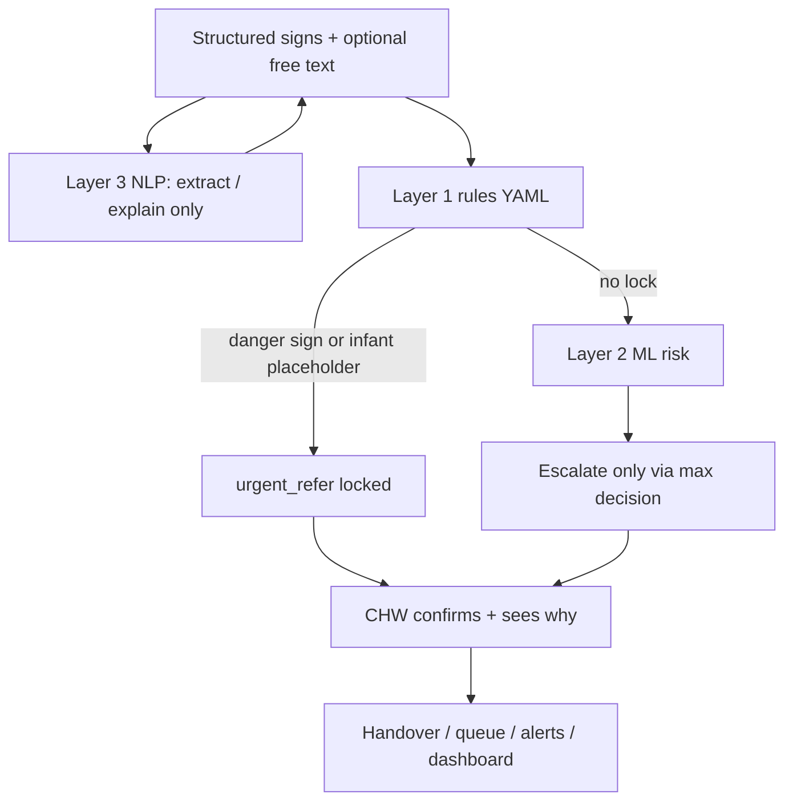
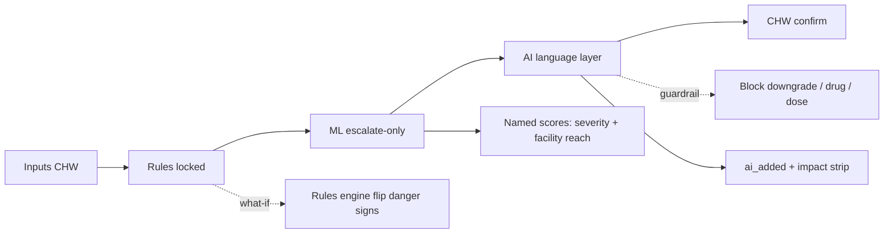
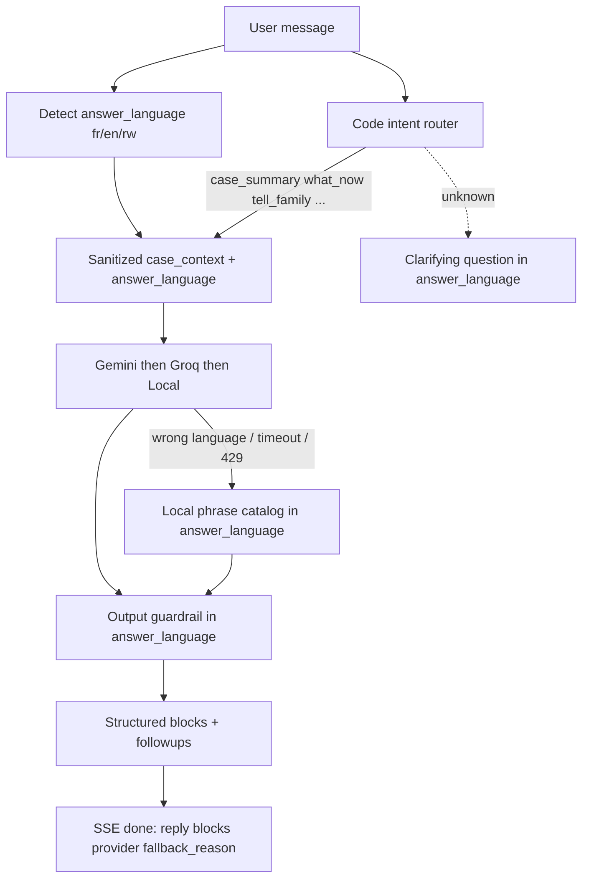

# Architecture — ZeroMalaria

**Synthetic demo data.** Decision support tool. Not a replacement for clinical judgment.

## Roles and access

See [docs/rbac.md](rbac.md) for the permission matrix and anti-escalation rules.





### RBAC tables (ER)

```mermaid
erDiagram
  users ||--o{ refresh_tokens : has
  users ||--o{ user_permission_overrides : may_have
  roles ||--o{ role_permissions : grants
  permissions ||--o{ role_permissions : granted_by
  users ||--o{ audit_logs : acts
  users {
    string id PK
    string username
    string role
    bool must_change_password
    string password_prompt_status  // pending | changed | dismissed
    datetime deleted_at
    int version
  }
  permissions {
    string code PK
  }
  roles {
    string code PK
    bool locked
  }
  role_permissions {
    int id PK
    string role_code
    string permission_code
  }
```

| Role | Primary UI | API scope |
| --- | --- | --- |
| `CHW` | `/app/home` + `/app/triage`; phone `/m/*` | Own referrals; sync queue |
| `HEALTH_CENTER` | `/app/referrals` inbox | Facility referrals; status PATCH; CHWs read-only |
| `RBC_ADMIN` | `/app/dashboard` + admin CRUD | National (no matrix edit) |
| `SUPER_ADMIN` | All + `/app/permissions` | Full |

Login: username/password only → server returns role + permissions → redirect by role (or prior URL if allowed).

Demo-only logins: see README § Demo only.

Pilot districts in seed (synthetic; *source: RBC problem canvas, to be verified*): **Gisagara**, **Nyamagabe**, plus Nyamasheke / Nyagatare.

## Live cross-role events



Frontend: `EventProvider` opens SSE `GET /events?access_token=…` with poll fallback (12s safety / 4s if SSE fails). Live Demo Board: `/demo/board` (three panes).

i18n: `apps/web/src/locales/{rw,en}/*.json` is the translation source of truth (`lng`/`fallbackLng`=`rw`; browser language ignored).

## Voice dialogue state machine



Result speech = fixed catalog + `triggered_rules` only (never free LLM text). Playback: audio pack → `/voice/speak` → lang-matched browser TTS → text highlight.

## Offline vs online tiers

```mermaid
flowchart LR
  subgraph tier1 [Tier 1 — always local]
    RulesTS[YAML rules in TS]
    IDB[(IndexedDB)]
    Queue[Sync queue]
  end

  subgraph tier2 [Tier 2 — online optional]
    TriageAPI[POST /triage]
    NLP[/nlp / ai routes]
    Voice[/voice/speak → Pindo Kinyarwanda TTS]
  end

  subgraph tier3 [Tier 3 — online required]
    Inbox[Facility inbox poll]
    Dash[RBC KPIs + hotspots]
    Auth[JWT login]
  end

  RulesTS --> IDB --> Queue
  Queue -->|POST /sync| DB[(SQLite)]
  tier2 --> DB
  tier3 --> DB
```

- **Tier 1:** CHW can complete triage and urgent referral with no network; decisions use the same rules file as the server.
- **Tier 2:** When online, server triage/AI can enrich; failures fall back to local rules + mock NLP.
- **Tier 3:** Nurse/RBC operational views poll the API; RBC hotspots are skipped when offline (empty signals, no error banner).

## AI provider fallback



Env: `ZM_GEMINI_API_KEY`, `ZM_GROQ_API_KEY`, `ZM_AI_PROVIDER_ORDER`, `ZM_AI_TIMEOUT_SECONDS`. No keys → Local only.

## System context



## Decision layers



## Result `ai_trace` pipeline (visible AI layer)

Clinical authority stays with rules. ML may only escalate. LLM / Local catalog only wording + checks.



API: `ai_trace` on `POST /triage` (`include_ai_trace`); `POST /ai/trace` (payload); `POST /ai/compare` (Gemini|Groq|Local). `ai_added` items carry `placement` (`summary` | `family` | `nurse` | `row:<question_id>`). Prevention plan from `apps/api/app/protocol/prevention.yaml` (pending clinical validation). Voice: `POST /voice/transcribe` (provider order `ZM_STT_PROVIDER_ORDER`, mock default), `GET /voice/capabilities` (self-test), `POST /voice/speak` (phrase pack → text-only for free RW). UI: Rules only vs Rules + AI on Result modal; dual-column independent scroll.

## Web-only shell

All product routes live under `/app/*`. Legacy `/m/*` paths redirect to the matching `/app` route. One `WebShell` (fixed sidebar, sticky header, scrollable main) serves every role from 390px to 1920px. There is no phone-frame mobile app or bottom tab bar.

## Chat intent routing



`GET /ai/status` pings each provider (cached 60s): `ok | no_key | timeout | rate_limited | error`. Chat timeout: `ZM_AI_CHAT_TIMEOUT_SECONDS` (default 15).

## Voice sequence

```mermaid
sequenceDiagram
  participant CHW
  participant UI as Voice stepper
  participant API as FastAPI
  participant STT as STT chain
  participant Chat as /ai/chat
  participant TTS as Pack / Vertex / browser
  CHW->>UI: Push-to-talk
  UI->>API: /voice/transcribe (Bearer + FormData)
  API->>STT: mock or cloud
  STT-->>UI: transcript
  UI->>Chat: message + case
  Chat-->>UI: guarded reply
  UI->>TTS: speak (EN Vertex if configured; RW pack/text)
```

## Single source of clinical truth
- `rules/malaria_rules.yaml` → `apps/api/engine/rules.py`
- Same YAML → `apps/web/scripts/generate_rules_ts.py` → `src/rules/malariaRules.generated.ts` → offline `evaluateRules`

## Offline sync
1. CHW completes triage with local rules.
2. Referral stored in IndexedDB and sync queue with client UUID.
3. On connectivity, `POST /sync` upserts by `client_uuid` (idempotent).
4. Facility and CHW UIs poll for status changes.

## Safety invariant
`final_decision = max_rank(rules_decision, ml_proposed_decision)`  
Unit tests in `apps/api/tests/test_decision.py` and `apps/web/src/rules/engine.test.ts` enforce that urgent referral cannot be downgraded.
